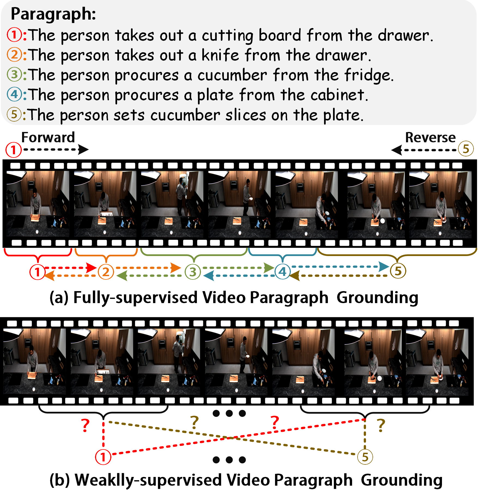
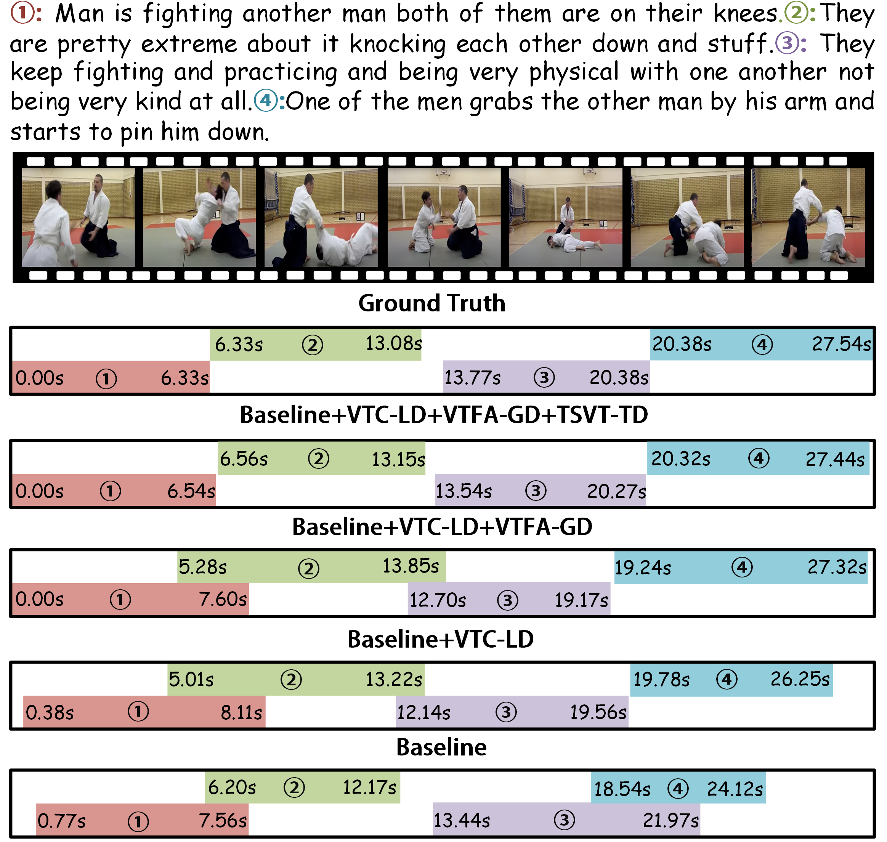

# VTH-VPG
========
This is the official implementation of [Visual-Textual Harmony: Multi-Dimensional Congruity for Weakly Supervised Video Paragraph Grounding].

<p align="center">
  
</p>

<p align="center">
  
</p>

## Dataset
Please download the visual features from the official website of ActivityNet: [Official C3D Feature](http://activity-net.org/download.html). And you can download preprocessed annotation files [here](https://github.com/baopj/DenseEventsGrounding/blob/main/DepNet_ANet_Release/files_/acnet_annot.zip). 

## Prerequisites
- python 3.5
- pytorch 1.4.0
- torchtext
- easydict
- terminaltables

## Training
Use the following commands for training:
```
cd moment_localization && export CUDA_VISIBLE_DEVICES=0
python dense_train.py --verbose --cfg ../experiments/dense_activitynet/acnet.yaml
```


## Acknowledgement
Part of our code is based on the previous works https://github.com/microsoft/VideoX/tree/master/2D-TAN and https://github.com/baopj/DenseEventsGrounding.
